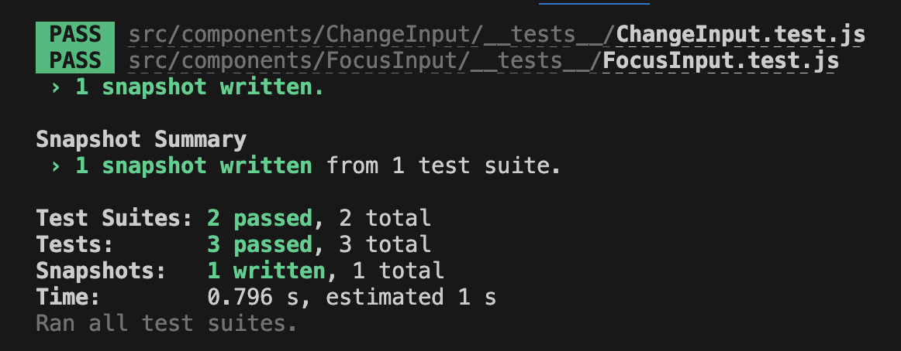

# RTL Testing Input

## Add GIF of expected behavior here!!!

### Helpful Tips to Get You Started

##### Setup Commands
```
git clone <repo>
# install dependencies
npm i
# run and view application ui in browser
npm run start
# run and view test output 
npm run test
# create snapshot test
npm test -- -u
```

##### Syntax
- `getByLabelText` to select elements via `aria-label`
- `fireEvent.change` to simulate change events - accepts an `event` object
- `container.firstChild` is the DOM tree of the component and can be used in snapshot testing
- `getByPlaceholderText` to select via input `placeholder`
- `document.activeElement` is the same DOM node returned by the getter
- Before setting up your test suites, you should use `afterEach(cleanup)` (after imports) in order to unmount any React trees that were mounted with render

### Testing a Focused Element
Create two tests for the FocusInput component.

- The first test should handle matching snapshot content. 
  - Set a rendered `ChangenInput` to a deconstructed `container`. 
  - Verify that the first instance of the component in the container matches the populated snapshot.

- The second test should emulate properly focusing input following a button trigger. 
  - Set a rendered `ChangenInput` to a deconstructed `getByPlaceholderText` and `getByText`.
  - Simulate a click event on button text "Click to Focus". Verify that the active element within the document has the text "Focus me!"

### Testing for an Input Change
Create a single test for the ChangeInput component. 

- The test should handle displaying the correct greeting. 
  - Set a rendered `ChangenInput` to a deconstructed `getByLabelText` and `getByTestId`.
  - Set `input` variable to label text "user-name".
  - Set `greeting` variable to ID "change-input-greeting". 
  - Assert that expected input value should be empty. 
  - Assert that expected greeting text should be "Welcome, Anonymous User!" Simulate a change input event where text value is changed. 
  - Verify that the changed input value text is as expected. 
  - Verify that the greeting text has replaced "Anonymous User" with the changed input value.

### Snapshot Tests
Notice that the FocusInput component test directory has a new directory called `__snapshots__`.


##### What are Snapshots?
This file is a fully rendered version of the component with html elements and other details. Snapshot tests are a very useful tool whenever you want to make sure your UI does not change unexpectedly. A typical snapshot test case renders a UI component, takes a snapshot, then compares it to a reference snapshot file stored alongside the test. It helps you determine whether the output continues to behave as expected or not. This is a very useful testing method as there are higher chances that something will break as you revisit your code to make updates over time.

##### How do Snapshots Work?
In your `__tests__` directory, create a `__snapshots__` directory. When you are testing with the intention to populate a new snapshot (or update an existing snapshot file), run `npm test -- -u`. If there is no existing snapshot for that test, it will populate a new file in the `__snapshots__` directory. If snapshot test files already exist, this command will update the snapshot content if there were any recent changes made to its respective component.
